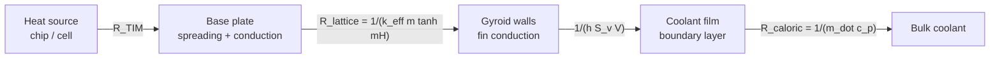

# Micro-Level Design of a Gyroid-Based Thermal Management System

**Scope.** Here, "micro level" means the **unit cell and below**: the gyroid cell, its
walls, the boundary layer next to those walls, and the wall surface. Cell geometry at this
level sets three numbers that drive everything above it in the system: the
**heat-transfer area**, the **convective coefficient**, and the **pressure drop**. System-level
parts (pump, radiator/chiller, control loop) are out of scope except where they connect to
the cell.

**How the claims are labelled**

| Label | Meaning |
|---|---|
| **[computed]** | Calculated in this repo by [`scripts/gyroid_micro.py`](../scripts/gyroid_micro.py). You can reproduce it. |
| **[source]** | Taken from a cited publication. I checked these against the abstract or the publisher's metadata. I could not read the full texts, so check numbers against the paper before relying on them. |
| **[assumed]** | An input I chose for illustration. Replace it with your own data. |
| **[judgement]** | My engineering reasoning. It is not a measured result. |

---

## 0. Key takeaways

1. **Geometry rules of thumb** for the standard level-set gyroid **[computed]**:
   - mid-surface area density ≈ **3.09 / a** (a = cell size)
   - sheet-gyroid solid fraction φₛ ≈ **0.65·t** for thin sheets
   - wall thickness ≈ **φₛ·a / 3.09**
   - hydraulic diameter of each channel ≈ **0.53·a** at 80 % porosity
2. **Shrinking the cell is what makes it "micro".** If Nu stays constant, the volumetric
   conductance h·Sᵥ grows as **1/a²**. Pressure gradient at fixed velocity also grows as
   **1/a²**. Thermal resistance of a fin-limited lattice falls only as **∝ a**. So halving
   the cell size roughly halves the resistance and quadruples the pumping penalty **[computed, §4]**.
3. **Walls conduct like ~0.6–0.7 of a solid block of the same mass.** The effective
   conductivity of the sheet-gyroid frame is k_eff ≈ (0.6–0.7)·φₛ·kₛ **[computed, §3.3]**. This
   sets the useful lattice height above a heated base, about 2/m. In the worked example
   below, 2/m ranges from ~0.35 mm (fine cells, high Nu) to ~5.5 mm (coarse cells, low Nu).
4. **Manufacturing, not physics, sets the smallest cell.** At 70–80 % porosity, a
   ~0.2 mm LPBF wall means cells of about 2–3 mm. Micro-LPBF walls of ~0.1 mm mean cells of
   about 1–1.5 mm **[computed from sourced wall limits]**. Rarefied-gas (Knudsen) effects only
   appear with air channels below ~70 µm, which is far below what metal AM prints today
   **[computed, §3.6]**.
5. **Wall material matters only for polymer walls.** A 0.2 mm metal wall adds little
   resistance compared with convection. A 0.3 mm polymer wall on its own caps U at about
   670 W/m²K **[computed, §3.4]**.
6. **There is no single trusted gyroid Nu/f correlation here.** The published ones depend on
   how the authors define D_h, the Reynolds-number range, and the porosity. §4 therefore treats
   Nu and f·Re as **explicit assumptions** and shows how sensitive the results are to them.

---

## 1. Where the micro level sits in a thermal management system

| Level | What lives here | Governing quantities | This document |
|---|---|---|---|
| L0 System | Pump, radiator/chiller, loop, controls | Q, ṁ, ΔT_loop, pump power | Interfaces only |
| L1 Component | Cold plate, compact heat exchanger, battery plate, PCM enclosure | Footprint, inlet/outlet manifolds, flow distribution | Interfaces only |
| L2 Core | The gyroid block: thickness H, grading, flow length L | ε-NTU, Δp_core | §4 |
| **L3 Unit cell** | **Cell size a, level-set t (→ φₛ), sheet vs network topology** | **Sᵥ, D_h, wall w, porosity** | **§2** |
| **L4 Wall & boundary layer** | **Wall conduction, fin efficiency, convective film, roughness** | **h, k_eff, η, Ra/D_h** | **§3** |
| L5 Material / sub-micro | AM microstructure and porosity (→ kₛ), surface chemistry, fouling | kₛ, R_fouling | §5, §7 |



---

## 2. Unit-cell geometry (L3)

### 2.1 Definition

The gyroid was described by Alan Schoen in a NASA technical note in 1970 **[source: Schoen 1970]**.
In engineering it is almost always modelled with the trigonometric level-set
*approximation* of the true minimal surface:

$$
f(x,y,z)=\sin X\cos Y+\sin Y\cos Z+\sin Z\cos X,\qquad X=\frac{2\pi x}{a}
$$

There are two ways to turn this surface into a solid:

| Topology | Solid region | Fluid domains | Typical thermal use |
|---|---|---|---|
| **Sheet** (matrix, "double gyroid wall") | \|f\| ≤ t | **Two separate, interpenetrating labyrinths**, mirror images of each other | Two-fluid heat exchangers (hot in one labyrinth, cold in the other). Cold plates that run coolant through both labyrinths. |
| **Network** (skeletal) | f > c | One connected labyrinth | Single-fluid heat sinks, PCM/foam replacement, porous media |

The two-labyrinth property is what makes the sheet gyroid suited to heat exchangers. The
surface separates two fluids with one continuous, leak-free wall and needs no headers inside
the core. For the level-set form, inversion x → −x gives f → −f, so the two labyrinths
f > t and f < −t are congruent mirror images **[computed/analytic]**.

### 2.2 Geometric constants (dimensionless, per cell size a) [computed]

Method: smoothed-delta co-area integration on a 256³ grid. I validated it on a plane test
case (exact = 2.000, got 2.02). The mid-surface value converges to **3.09** as the grid is
refined (3.0904 → 3.0918 for 128³ → 384³).

**Sheet gyroid** (solid |f| ≤ t)

| t | φₛ (solid) | porosity | total wetted area · a | D_h / a (each labyrinth) | wall / a |
|---|---|---|---|---|---|
| 0.05 | 0.032 | 0.968 | 6.18 | 0.627 | 0.010 |
| 0.10 | 0.064 | 0.936 | 6.17 | 0.607 | 0.021 |
| 0.20 | 0.129 | 0.871 | 6.14 | 0.568 | 0.042 |
| 0.30 | 0.193 | 0.807 | 6.08 | 0.530 | 0.063 |
| 0.40 | 0.259 | 0.741 | 6.00 | 0.494 | 0.084 |
| 0.50 | 0.324 | 0.676 | 5.89 | 0.460 | 0.105 |
| 0.60 | 0.389 | 0.611 | 5.76 | 0.425 | 0.126 |
| 0.80 | 0.523 | 0.477 | 5.37 | 0.356 | 0.169 |

**Network gyroid** (solid f > c)

| c | φₛ | porosity | wetted area · a | D_h / a |
|---|---|---|---|---|
| −0.6 | 0.695 | 0.305 | 2.88 | 0.425 |
| −0.3 | 0.597 | 0.403 | 3.04 | 0.530 |
| 0.0 | 0.500 | 0.500 | 3.09 | 0.647 |
| 0.3 | 0.403 | 0.597 | 3.04 | 0.785 |
| 0.6 | 0.305 | 0.695 | 2.88 | 0.966 |

Definitions:

- D_h = 4 × (fluid volume of one labyrinth) / (its wetted area).
- Wall thickness = solid volume ÷ mid-surface area. This is a mean value. The real sheet is
  thicker where |∇f| is small.

**Key observation [computed].** At the same porosity, a sheet gyroid has **~1.7–2.4× the
wetted area** of a network gyroid (both faces of the sheet are wetted; the ratio grows with
porosity). Its channels are also
narrower. Both effects favour heat transfer, and both raise pressure drop.

### 2.3 Scaling with cell size (sheet gyroid, φₛ = 0.20, i.e. 80 % porosity) [computed]

| a | wall | D_h (each) | separating-wall area density | total wetted area density |
|---|---|---|---|---|
| 5 mm | 323 µm | 2.63 mm | 618 m²/m³ | 1 215 m²/m³ |
| 2 mm | 129 µm | 1.05 mm | 1 546 m²/m³ | 3 038 m²/m³ |
| 1 mm | 65 µm | 527 µm | 3 092 m²/m³ | 6 076 m²/m³ |
| 0.5 mm | 32 µm | 263 µm | 6 183 m²/m³ | 12 151 m²/m³ |
| 0.2 mm | 13 µm | 105 µm | 15 458 m²/m³ | 30 378 m²/m³ |

**Cross-check against a published device.** Dixit et al. (2022) report a stereolithography
gyroid liquid–liquid heat exchanger with 80 % porosity, a 300 µm separating wall and
670 m²/m³ surface-to-volume ratio **[source]**.

- These three numbers agree with the thin-sheet identity S ≈ φₛ / w: 0.20 / 300 µm = 667 m²/m³.
- Using the table above, they imply a cell size of about 4.6 mm. *That cell size is my
  inference, not a value stated in their abstract.*

By Kandlikar's channel classification **[source]**, the hydraulic diameters above fall into:

- **conventional channels** (> 3 mm)
- **minichannels** (200 µm – 3 mm)
- **microchannels** (10 – 200 µm)

A "micro-architected" gyroid made by today's metal AM is therefore mostly a *mini*channel
device by hydraulic diameter. True microchannel gyroids (D_h < 200 µm) need cells of about
0.4 mm or smaller.

---

## 3. Micro-scale heat-transfer physics (L4)

### 3.1 Thermal resistance chain

**Two-fluid sheet-gyroid heat exchanger** (per unit cell, wall area ≈ S₀a²):

$$
\frac{1}{U}=\frac{1}{h_h}+\frac{w}{k_s}+\frac{1}{h_c}+R''_{f,h}+R''_{f,c},
\qquad \frac{UA}{V}=U\,\frac{3.09}{a}
$$

**Base-heated cold plate** (one coolant in both labyrinths). The lattice acts as a
*porous fin*. In this volume-averaged model:

- the solid frame conducts with k_eff;
- it exchanges heat with the fluid through the volumetric coefficient h·Sᵥ;
- the fluid is held at its local bulk temperature.

$$
m=\sqrt{\frac{h\,S_v}{k_{\text{eff}}}},\qquad
R''_{\text{lattice}}=\frac{1}{k_{\text{eff}}\,m\,\tanh(mH)},\qquad
\eta=\frac{\tanh(mH)}{mH}
$$

$$
R''_{\text{total}}\approx R''_{\text{TIM}}+R''_{\text{base}}+R''_{\text{lattice}}+\frac{A_{\text{footprint}}}{\dot m c_p}
$$

This is a standard first-order fin/porous-medium approximation. It is not a substitute for
conjugate CFD: it ignores flow maldistribution, spreading resistance and entrance effects
**[judgement]**.

### 3.2 Convection inside the labyrinth

- **Coefficient.** h = Nu · k_fluid / D_h. If Nu stays roughly constant (laminar flow), h
  scales as **1/a**. Wetted area density also scales as **1/a**. So **h·Sᵥ ∝ 1/a²**
  **[computed scaling]**. This is the main reason to go "micro".
- **Why a gyroid beats straight channels.** The literature attributes the higher heat
  transfer to the continuously curved sheet. It repeatedly redirects the flow and mixes it
  locally, so the thermal boundary layer keeps redeveloping. It also avoids the sharp strut
  intersections of beam lattices **[source: reviews and CFD studies listed in References]**.
  Kaur & Singh (2021) found gyroids gave better thermal performance than Schwarz-P at equal
  pumping power **[source]**.
- **The penalty.** The same studies report that higher heat transfer generally comes with
  higher pressure drop **[source]**.
- **Correlations.** Laminar Nu and f data for gyroid and other TPMS/PNS cells are given by
  Iyer et al. (2022). Further correlations are in Reynolds et al. (2023) and a 2024 IJHMT
  gyroid/diamond channel study **[source]**. I could not read the full texts, so I do not
  reproduce their coefficients. Use them directly, and check that their D_h definition
  matches the one in §2.2.

### 3.3 Conduction through the walls (effective conductivity) [computed]

I solved a periodic homogenisation problem on a voxelised sheet gyroid using finite volumes
with harmonic-mean face conductances and conjugate gradients. The fluid-to-solid conductivity
ratio was 10⁻⁴. Cubic symmetry makes k_eff isotropic.

| t | φₛ | k_eff/kₛ (64³) | (96³) | (128³) | k_eff / (φₛ kₛ) at 128³ |
|---|---|---|---|---|---|
| 0.2 | 0.129 | 0.070 | 0.075 | 0.078 | 0.61 |
| 0.4 | 0.258 | 0.161 | 0.166 | 0.169 | 0.65 |
| 0.6 | 0.390 | 0.257 | 0.266 | 0.269 | 0.69 |

**Result.** k_eff ≈ **(0.6–0.7) · φₛ · kₛ**. Values still rise slightly as the grid is
refined, because voxel staircasing penalises thin walls. Treat the 128³ numbers as slight
underestimates. The ratio approaches the ≈ 2/3 expected for an isotropic network of thin
plates **[judgement]**.

Catchpole-Smith et al. (2019) measured the conductivity of LPBF TPMS lattices
experimentally **[source]**. Use measured data when you can, because AM porosity and
microstructure lower kₛ itself.

**Consequence: the useful lattice height is about 2/m.** Beyond that, tanh(mH) ≈ 1 and
extra height adds weight and pressure drop but almost no heat removal. Smaller cells raise
m, so the optimal core gets *thinner* as the cell gets smaller.

### 3.4 Wall resistance: metal vs polymer [computed, nominal handbook kₛ, assumed]

| Wall | w | kₛ (nominal) | w/kₛ [m²K/W] | Compare with 1/h at h = 5 000 W/m²K (2×10⁻⁴) |
|---|---|---|---|---|
| Copper | 0.2 mm | ~380 W/mK | 5×10⁻⁷ | negligible |
| AlSi10Mg (as-built kₛ varies) | 0.2 mm | ~120–150 W/mK | ~1.5×10⁻⁶ | negligible |
| 316L | 0.2 mm | ~15 W/mK | 1.3×10⁻⁵ | ~6 % |
| Photopolymer | 0.3 mm | ~0.2 W/mK | 1.5×10⁻³ | **dominates**: caps U ≤ ~670 W/m²K |

### 3.5 Pressure drop scaling

For laminar flow:

$$
\frac{\Delta p}{L}=\frac{(f\,Re)\,\mu\,u}{2\,D_h^2}
$$

At fixed interstitial velocity, **Δp ∝ 1/a²**.

- For straight ducts, the Darcy f·Re is 64 for a circular tube and 96 for parallel plates.
- For a gyroid it is expected to be higher, because of tortuosity and repeated flow
  redevelopment **[judgement]**.
- §4 uses **f·Re = 100 as a placeholder [assumed]**.

### 3.6 Is continuum physics still valid at this scale? [computed + source]

- **Knudsen number.** Kn = λ / D_h. Sources put the no-slip continuum limit at Kn < 0.001
  or Kn < 0.01; the slip regime extends to Kn < 0.1 **[source]**.
- **Air.** At ambient conditions the mean free path is λ ≈ 0.07 µm. Slip effects therefore
  start at D_h ≈ 7–70 µm.
- **Water.** Continuum holds well below that.
- **Conclusion.** For any gyroid that metal AM can currently print (D_h ≳ 100 µm), standard
  Navier–Stokes with no-slip and Fourier conduction applies. The micro-scale effects that
  *do* matter are:
  - surface roughness relative to D_h
  - powder/particle clogging
  - fouling
  - manufacturing deviation of wall thickness

---

## 4. Worked example: copper sheet-gyroid cold plate at 100 W/cm²

**Inputs:**

| Input | Value | Label |
|---|---|---|
| Lattice | Sheet gyroid, φₛ = 0.30 (70 % porosity, t = 0.464) | |
| Solid | Copper, kₛ = 380 W/mK | [assumed; AM copper can be lower] |
| k_eff | 74.8 W/mK | [computed, 96³] |
| Lattice height | H = 2 mm | |
| Heat flux | q″ = 100 W/cm² | |
| Coolant | Water at ~30 °C | |
| Flow | Interstitial velocity u = 0.5 m/s, flow length L = 10 mm | |
| Nu | 5 / 10 / 20 | **[assumed]** |
| f·Re | 100 | **[assumed]** |

**Results** (`python3 scripts/gyroid_micro.py coldplate`):

| a | wall | D_h | Sᵥ (wetted) | Re | Nu | h [W/m²K] | mH | η | R″ [K·cm²/W] | ΔT [K] | Δp [kPa] |
|---|---|---|---|---|---|---|---|---|---|---|---|
| 2.0 mm | 194 µm | 944 µm | 2 968 | 590 | 5 | 3 259 | 0.72 | 0.86 | 0.603 | 60.3 | 0.22 |
| | | | | | 10 | 6 518 | 1.02 | 0.76 | 0.342 | 34.2 | |
| | | | | | 20 | 13 037 | 1.44 | 0.62 | 0.208 | 20.8 | |
| 1.0 mm | 97 µm | 472 µm | 5 935 | 295 | 5 | 6 518 | 1.44 | 0.62 | 0.208 | 20.8 | 0.90 |
| | | | | | 10 | 13 037 | 2.03 | 0.48 | 0.136 | 13.6 | |
| | | | | | 20 | 26 073 | 2.88 | 0.35 | 0.094 | 9.4 | |
| 0.5 mm | 49 µm | 236 µm | 11 871 | 147 | 5 | 13 037 | 2.88 | 0.35 | 0.094 | 9.4 | 3.58 |
| | | | | | 10 | 26 073 | 4.07 | 0.25 | 0.066 | 6.6 | |
| | | | | | 20 | 52 146 | 5.75 | 0.17 | 0.047 | 4.6 | |
| 0.25 mm | 24 µm | 118 µm | 23 741 | 74 | 5 | 26 073 | 5.75 | 0.17 | 0.047 | 4.6 | 14.3 |
| | | | | | 10 | 52 146 | 8.14 | 0.12 | 0.033 | 3.3 | |
| | | | | | 20 | 104 292 | 11.51 | 0.09 | 0.023 | 2.3 | |

ΔT is the lattice-only rise from base to coolant. It excludes TIM, base conduction and coolant
heating. Coolant heating is a separate term: for a 10 × 10 mm footprint, the flow above is
0.35 m/s superficial × 10 mm × 2 mm ≈ 0.42 L/min, so 100 W adds about **3.4 K** of caloric
rise **[computed]**.

**How to read the table [computed results, judgement on interpretation]:**

1. **Going from a = 1 mm to 0.5 mm** (Nu = 10) cuts R″ from 0.136 to 0.066 K·cm²/W (×0.48)
   and raises Δp from 0.9 to 3.6 kPa (×4). That is the micro-level trade-off in one line.
2. **For a ≤ 1 mm, mH > 2.** Most of the 2 mm lattice height does little work. Either
   reduce H toward ~2/m, or switch to a *graded* lattice: denser near the base, more open
   above.
3. **Manufacturability rules out the fine cells.** At φₛ = 0.30, walls fall below ~100 µm
   for a < 1 mm. That is below the thinnest metal-AM gyroid walls I could source (§5). Fine
   cells need a higher φₛ, which reduces D_h and raises Δp, or a different process.
4. **The Re values (74–590) and the Nu range are illustrative.** Before committing to a
   design, replace them with a gyroid correlation in the matching Re range, or with
   conjugate CFD.

---

## 5. Manufacturing at the micro level

| Process / example | Demonstrated feature | Material | Label |
|---|---|---|---|
| LPBF (laser powder bed fusion) gyroid heat-exchanger cores | Walls printed at **> 0.2 mm** | AlSi10Mg | [source: Int J Adv Manuf Technol 2023; see References] |
| Micro-LPBF (finer beam, finer powder, thinner layers) | **100 µm** TPMS walls; 2.1 µm roughness on cube samples | 316L | [source: Qu, Ding & Song 2021] |
| Stereolithography gyroid heat exchanger | **300 µm** separating wall, 80 % porosity | Photopolymer | [source: Dixit et al. 2022] |
| Electrochemical AM (ECAM) copper cold plate | Gyroid-infill cold plate; vendor reports **35 %** thermal-resistance improvement | Copper | [source: Fabric8Labs, Hot Chips 2023 — **vendor claim**] |
| Nature: butterfly wing scales | Single-gyroid lattice at **~300 nm** | Chitin/air | [source: Saranathan et al. 2010]. Photonic function, not thermal; shows the shape exists at the sub-micron scale |
| Historical microchannel benchmark | 790 W/cm² at 71 °C rise | Silicon, etched straight channels (not gyroid) | [source: Tuckerman & Pease 1981] |

Micro-level manufacturing issues to design around **[judgement]**:

- **Minimum wall → minimum cell.** a_min ≈ w_min · 3.09 / φₛ. Examples:
  - LPBF, w_min = 0.2 mm, φₛ = 0.2 → a_min ≈ 3.1 mm
  - micro-LPBF, w_min = 0.1 mm, φₛ = 0.3 → a_min ≈ 1.0 mm
- **Roughness relative to D_h.** As-built powder-bed surfaces carry adhered particles,
  especially on down-facing walls. Once Ra reaches a few percent of D_h, it measurably changes
  friction, heat transfer and the effective D_h. Measure it on witness coupons in the same
  orientation.
- **Trapped powder.** Every labyrinth needs an open path for depowdering. CT-scan the cores
  before thermal testing.
- **Fouling and particulates.** Channels in the 100 µm range need coolant filtration rated
  well below D_h.
- **Leak integrity.** In two-fluid sheet gyroids, the wall *is* the pressure boundary.
  Thin-wall porosity from AM is a cross-contamination risk. Pressure-test at
  operating pressure plus margin.

---

## 6. Micro-level design procedure

1. **Fix the boundary conditions from L0–L1:** heat load, allowable ΔT, coolant, available Δp
   or pump curve, envelope.
2. **Choose the topology.**
   - Two fluids → **sheet** gyroid.
   - Single fluid with a heated base → sheet (more area) or network (larger D_h, lower Δp).
3. **Set the manufacturing floor.** Pick the process, take w_min, and compute
   a_min = w_min · 3.09 / φₛ (§2.3, §5).
4. **Pick φₛ and a.** Use §2.2 to get Sᵥ, D_h and w. Check Re = ρuD_h/μ.
5. **Get h** from a gyroid correlation valid at that Re and with matching D_h (§3.2), or
   from CFD.
6. **Get k_eff** (§3.3, ≈ 0.6–0.7 φₛkₛ). Use measured kₛ for the AM material.
7. **Size the core.**
   - Cold plate: H ≈ 1.5–2.5 / m.
   - Heat exchanger: area from ε-NTU, with UA/V = U · 3.09/a.
8. **Check Δp** with the matching f correlation. Iterate a, φₛ and u until thermal
   resistance and pumping power are both inside budget.
9. **Consider grading.** Vary t (and therefore φₛ) or a through the core: dense where heat
   flux is high, open where the flow needs to recover.
10. **Validate.** Run conjugate CFD on a few-cell periodic domain, then on the full core.
    Then test a CT-inspected print and compare R″ and Δp with the model.

---

## 7. Known gaps and uncertainties

- **No gyroid-specific Nu/f coefficients.** None are reproduced here, because I could not
  access the full papers. The §4 results scale directly with the assumed Nu and f·Re.
- **Level-set approximation.** All geometry is for the trigonometric approximation of the
  gyroid, not the exact minimal surface. Most CAD and CAE tools use this approximation.
- **k_eff is a voxel estimate.** It is slightly low at thin walls and assumes a fully dense,
  isotropic solid.
- **Simplified porous-fin model.** It ignores fluid temperature rise along the flow,
  spreading in the base, manifold maldistribution, and transition or unsteadiness at the
  higher Re values.
- **Roughness and leak behaviour are process-specific.** Treat the §5 notes as a test plan,
  not as data.

---

## 8. Reproducing the numbers

```bash
python3 scripts/gyroid_micro.py geometry   # §2 tables      (~10 s)
python3 scripts/gyroid_micro.py keff       # §3.3 table     (~1.5 min)
python3 scripts/gyroid_micro.py coldplate  # §4 table       (~1 min)
```

The only dependency is NumPy. To change inputs, edit the arguments of
`report_coldplate(...)`: φₛ, kₛ, H, q″, u, L, Nu values, f·Re.

---

## References

Each entry was checked against its abstract or the publisher's metadata via web search. I
could not read the full texts in this environment.

1. A. H. Schoen, *Infinite periodic minimal surfaces without self-intersections*, NASA TN D-5541, 1970. <https://ntrs.nasa.gov/citations/19700020472>
2. T. Dixit, E. Al-Hajri, M. C. Paul, P. Nithiarasu, S. Kumar, *High performance, microarchitected, compact heat exchanger enabled by 3D printing*, Applied Thermal Engineering 210 (2022) 118339. <https://eprints.gla.ac.uk/267634> (abstract: 80 % porosity, 300 µm wall, 670 m²/m³, U = 120–160 W/m²K at Re 10–40, +55 % effectiveness vs. an equivalent counter-flow exchanger at one tenth of its size)
3. J. Iyer, T. Moore, D. Nguyen, P. Roy, J. Stolaroff, *Heat transfer and pressure drop characteristics of heat exchangers based on triply periodic minimal and periodic nodal surfaces*, Applied Thermal Engineering 209 (2022) 118192. <https://doi.org/10.1016/j.applthermaleng.2022.118192>
4. I. Kaur, P. Singh, *Flow and thermal transport characteristics of Triply-Periodic Minimal Surface (TPMS)-based gyroid and Schwarz-P cellular materials*, Numerical Heat Transfer, Part A 79 (2021) 553. <https://doi.org/10.1080/10407782.2021.1872260>
5. B. W. Reynolds et al., *Characterisation of heat transfer within 3D printed TPMS heat exchangers*, Int. J. Heat Mass Transfer 212 (2023) 124264. <https://www.sciencedirect.com/science/article/pii/S0017931023004167>
6. *A numerical investigation of heat transfer and pressure drop correlations in Gyroid and Diamond TPMS-based heat exchanger channels*, Int. J. Heat Mass Transfer (2024). <https://www.sciencedirect.com/science/article/abs/pii/S0017931024014273>
7. S. Catchpole-Smith, R. R. J. Sélo, A. W. Davis, I. A. Ashcroft, C. J. Tuck, A. Clare, *Thermal conductivity of TPMS lattice structures manufactured via laser powder bed fusion*, Additive Manufacturing 30 (2019) 100846. <https://eprints.nottingham.ac.uk/60244>
8. S. Qu, J. Ding, X. Song, *Achieving triply periodic minimal surface thin-walled structures by micro laser powder bed fusion process*, Micromachines 12 (2021) 705. <https://doi.org/10.3390/mi12060705>
9. *Enhancement of heat exchanger performance using additive manufacturing of gyroid lattice structures*, Int. J. Adv. Manuf. Technol. (2023). <https://link.springer.com/10.1007/s00170-023-11362-9> (gyroid AlSi10Mg cores printed with walls > 0.2 mm)
10. V. Saranathan et al., *Structure, function, and self-assembly of single network gyroid (I4₁32) photonic crystals in butterfly wing scales*, PNAS 107 (2010). <https://pmc.ncbi.nlm.nih.gov/articles/PMC2900708>
11. D. B. Tuckerman, R. F. W. Pease, *High-performance heat sinking for VLSI*, IEEE Electron Device Letters EDL-2(5) (1981) 126–129.
12. Fabric8Labs, *ECAM for Cooling High Performance ICs*, Hot Chips 2023 (vendor presentation). <https://www.hc2023.hotchips.org/assets/program/conference/day2/FPGAs%20Cooling/Fabric8Labs%20-%202023%20Hot%20Chips%20-%20ECAM%20for%20Cooling%20High%20Performance%20ICs%20(2023.08.29).pdf>
13. S. G. Kandlikar, channel size classification (conventional > 3 mm; minichannels 200 µm–3 mm; microchannels 10–200 µm), as summarised in: <https://www.epj-conferences.org/articles/epjconf/pdf/2012/07/epjconf_EFM2011_01021.pdf>
14. Knudsen-number flow regimes: <https://en.wikipedia.org/wiki/Rarefied_gas_dynamics>, <https://doc.comsol.com/6.4/doc/com.comsol.help.mfl/mfl_ug_modeling.05.18.html>
