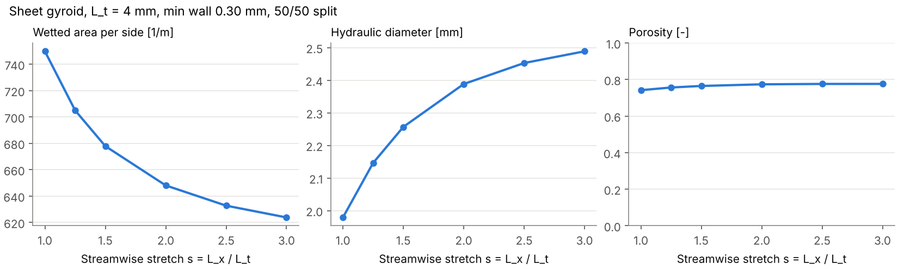
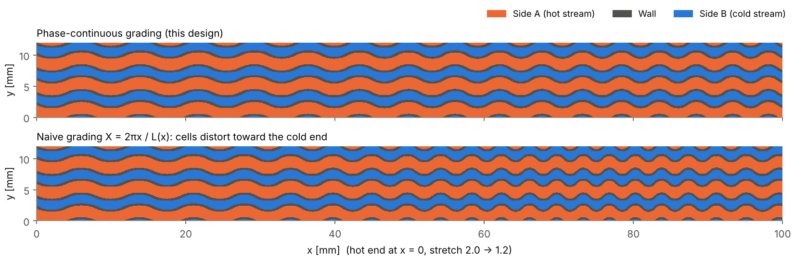

# Graded-Stretch Asymmetric Gyroid (GSAG) counterflow heat exchanger

A design concept for a two-fluid heat exchanger with **high effectiveness, high heat transfer per
unit volume, and low pressure drop**, built on a sheet-gyroid core. The geometry numbers below come
from [`gyroid_hx_geometry.py`](gyroid_hx_geometry.py). Performance claims come from the cited papers.
No CFD or testing has been done on this specific design yet.

> **Source note.** This was requested as an analysis of a shared Claude chat
> (`claude.ai/share/50b26922-…`). That page could not be retrieved from the build environment
> (Cloudflare's bot challenge blocked automated access), so this design rests on published
> literature on gyroid/TPMS heat exchangers, the topic of this repository, and **not on the
> chat's content**. If the chat set specific fluids, duty, or constraints, the schedule in
> Section 4 should be re-run with them.

---

## 1. Bottom line

A **uniform** gyroid does not deliver all three goals at once. It raises heat transfer, but its
pressure-drop penalty grows quickly. The proposed core keeps the gyroid's strengths (two separate
channel networks, all-primary surface, strong mixing) and removes most of the pressure drop the
uniform lattice wastes:

| # | Feature | What it fixes | Evidence |
|---|---------|---------------|----------|
| 1 | Sheet gyroid, two fluids in true counterflow | Highest attainable effectiveness. Every wall is a primary surface separating hot from cold | Li et al. 2020; Tondeur & Kvaalen 1987 |
| 2 | Cells stretched along the flow (s = L_x/L_t > 1) | Cuts tortuosity, which Yan et al. identify as the driver of their Δp reduction | Yan et al. 2025: −80 % Δp for −28 % heat transfer rate |
| 3 | Stretch graded hot end → cold end (s ≈ 2.0 → 1.2) | Puts surface area where it reduces entropy generation most, and removes it where low-density gas makes friction costly | Equipartition principle; Chen et al. 2023 (grading direction matters); Oh et al. 2025 (grading pays off in hardware) |
| 4 | Phase-continuous grading coordinate | Keeps graded cells the intended size (a naive formula gives a 40 % period error here) | Geometry, computed below |
| 5 | Asymmetric volume split via level-set offset c | Gives the low-density or high-volumetric-flow stream larger channels | arXiv 2512.10207 (+24.2 %), Ohtani et al. 2025 (+12.2 % PEC) |
| 6 | Wall held at the AM minimum by level-set grading t(x) | No wasted solid, no sub-minimum walls when s changes | Oh et al. 2025 (level-set gradation) |
| 7 | Filtered end faces + tapered plenums | Header maldistribution and losses can erase core gains | Oh et al. 2025 (filtering gradation); manifold literature |

**Novelty caveat.** Each feature has been published on its own. I did not find a paper that combines
all seven in one core, but my search was limited. Treat novelty as unverified; this is not a
patentability opinion.

---

## 2. Why a uniform gyroid falls short

| Finding | Source |
|---------|--------|
| Gyroid/Schwarz-D sCO₂ HX: overall thermal performance +15–100 %, Nu +16–120 % **at equal pumping power** vs. a PCHE (CFD) | Li, Yu & Yu 2020 |
| Gyroid sCO₂ HX: thicker walls and more cells raised h from 5678 to 7312 W/m²K (+29 %), but Δp rose from 20.3 to 183.4 kPa/m (≈ 9×) | Khalifa Univ. study |
| Metal-AM gyroid vs. commercial brazed plate HX (experiment, liquid–liquid): U up to +4.4 %, friction factor up to −30.5 % in the same Re range | SeoulTech experiment |
| Sheet vs. solid gyroid/diamond heat sinks: G-sheet has the highest hA; G-solid has the lowest friction factor | Khalifa Univ. heat-sink study |

**Takeaway.** The gyroid's advantage is real but conditional. It wins at equal pumping power or
equal volume. Making it denser buys a little heat transfer for a large Δp penalty. The design
levers below target that penalty.

---

## 3. The design, feature by feature

### 3.1 Topology: sheet gyroid, true counterflow

The wall is the region |G − c| ≤ t, with
`G = sin X cos Y + sin Y cos Z + sin Z cos X`. It splits space into two interpenetrating channel
networks that never intersect: side A (G − c > t) and side B (G − c < −t). Both fluids flow along
+x and −x respectively (counterflow).

- **Counterflow** gives the highest effectiveness for a given NTU and the lowest heat-transfer
  entropy generation. Tondeur & Kvaalen note that countercurrent flow dissipates less than co-current.
- **Every wall separates A from B**, so all surface is primary surface. There is no fin-efficiency
  loss as in plate-fin cores.

### 3.2 Streamwise stretch

The cell is longer along the flow (L_x = s·L_t) than across it (L_t). Yan et al. (2025, experiment
plus CFD) report a streamwise-stretched gyroid with **−80 % pressure drop for −28 % heat transfer
rate**. They attribute it to less tortuosity and weaker wall-induced disturbance.

What stretching costs geometrically (computed; L_t = 4 mm, min wall 0.30 mm, 50/50 split):

| s | Wetted area per side [m²/m³] | D_h [mm] | Porosity |
|---|---|---|---|
| 1.0 | 750 | 1.98 | 0.742 |
| 1.5 | 678 (−10 %) | 2.26 | 0.765 |
| 2.0 | 648 (−14 %) | 2.39 | 0.774 |
| 3.0 | 624 (−17 %) | 2.49 | 0.776 |



**Interpretation (my analysis).** Stretching to s = 2 removes only about 14 % of the surface area.
The large pressure-drop reductions Yan et al. report are therefore driven mainly by lower tortuosity,
not by lost area. That is why stretch is a good lever.

**Rough indicator (not confirmed):** if their −28 % / −80 % behaved like Nu and f at matched Re,
the usual criterion PEC = (Nu/Nu₀)/(f/f₀)^(1/3) gives 0.72 / 0.2^(1/3) ≈ **1.23**. Their quantities
are rates and pressure drops, not Nu and f at matched Re, and I could not access their stretch
ratio. Treat 1.23 as a back-of-envelope sign that stretching pays, not as a prediction.

### 3.3 Grading the stretch along the core

**Principle.** Tondeur & Kvaalen (1987) showed that, for a given transfer area and duty, total
entropy production is minimal when the local production rate is uniform along the device
(equipartition). In a gas–gas counterflow core:

- **Friction irreversibility** concentrates at the **hot end**, where gas density is lowest and
  velocity is highest.
- **Heat-transfer irreversibility** per unit heat scales roughly with (ΔT/T)². It is therefore
  smaller at the **hot end**, where T is high.

Both effects point the same way. Use **long, low-loss cells at the hot end** and **compact,
high-area cells at the cold end**. The default schedule is s = 2.0 → 1.2 on a smooth cosine
profile. This is illustrative: the right profile comes from the optimisation in Section 5.

**Evidence that grading direction matters:**
- Chen et al. 2023: graded-wall gyroids reached +26–60 % h and −9.7–18 % Δp vs. uniform.
  A 2:4:6 gradient beat the reverse 6:4:2 by 30 % in overall efficiency.
- Oh et al. 2025: cell-size gradation of 6–10 mm, tested in hardware, gave +30 % heat exchange
  capacity for only +0.3 kPa Δp (+28 % overall).

### 3.4 Phase-continuous grading coordinate (geometric correctness)

Writing `X = 2πx / L(x)` looks right but is not. Its local period is L / (1 − x·L′/L), so cells
far from x = 0 come out the wrong size. For this core (L_x from 8.0 to 4.8 mm over 100 mm), the
naive formula gives a **2.88 mm period at the cold end instead of 4.8 mm (−40 %)**.

The design uses X(x) = ∫₀ˣ 2π / L_x(x′) dx′ instead, which gives exactly the intended period
everywhere:



### 3.5 Asymmetric volume split (level-set offset c)

Shifting the level set from G = 0 to G = c moves the wall. One network grows and the other shrinks,
with no change in topology. Give the larger share to the stream with the larger volumetric flow:
- the low-pressure side of a recuperator;
- the gas side of a gas–liquid unit.

The default is a 60/40 split (c ≈ −0.24).

Evidence:
- Isosurface-threshold optimisation of a two-fluid TPMS lattice: **+24.2 %** average vs. uniform
  (arXiv 2512.10207, Primitive lattice).
- Optimised wall-thickness distribution in a gyroid two-fluid HX: **+12.2 % PEC** (Ohtani et al.
  2025).
- A 2025 Physics of Fluids study of air–kerosene gyroid HXs: the cold-to-hot volume and flow ratio
  materially changes overall performance.

### 3.6 Minimum wall held by level-set grading t(x)

Stretching changes the local wall thickness at a fixed level-set t. At each station the script
solves for the t that keeps the **5th-percentile local wall thickness at 0.30 mm**. This avoids
leak-prone thin spots without carrying excess solid, and it mirrors Oh et al.'s level-set
gradation.

The 0.30 mm value is an assumed LPBF capability; confirm it with your AM vendor. For
high-pressure service (e.g. sCO₂ at tens of MPa), wall thickness is set by stress analysis, not
printability.

### 3.7 Headers: filtered end faces and tapered plenums

The two networks must be separated at each end. A common approach is to **cap one network's
openings on each face**:
- At the hot-end face, side A is open to its plenum and side B is skinned over.
- Side B then exits through side-face windows in a short transition zone, where side A is capped.
- The cold end mirrors this arrangement.

Two further measures:
- Keep the transition zone at high stretch (low loss). Oh et al.'s *filtering gradation* does this
  job: it guides each fluid to its own port with reduced resistance.
- Use **tapered (converging/diverging) plenums**. In a non-TPMS parallel-flow manifold study,
  converging–diverging headers improved flow uniformity by up to 37.5 % (U-type) and 52.0 %
  (Z-type).

Ohtani et al. found that steering more flow to the core ends improves velocity uniformity and lets
the whole core work. **This is the least-resolved part of the design and needs dedicated CFD.**

---

## 4. Computed geometry: default schedule

L_t = 4 mm, core length 100 mm, hot end at x = 0, minimum wall 0.30 mm, side A share 60 %:

| x [mm] | s | t | c | ε_A | ε_B | wall | a_A [m²/m³] | D_h,A [mm] | D_h,B [mm] |
|---|---|---|---|---|---|---|---|---|---|
| 0 | 2.00 | 0.348 | −0.239 | 0.465 | 0.310 | 0.225 | 662 | 2.81 | 2.00 |
| 20 | 1.92 | 0.348 | −0.239 | 0.465 | 0.310 | 0.226 | 665 | 2.79 | 1.99 |
| 40 | 1.72 | 0.352 | −0.238 | 0.463 | 0.308 | 0.229 | 676 | 2.74 | 1.95 |
| 60 | 1.48 | 0.360 | −0.236 | 0.460 | 0.307 | 0.233 | 695 | 2.65 | 1.89 |
| 80 | 1.28 | 0.371 | −0.233 | 0.456 | 0.304 | 0.241 | 718 | 2.54 | 1.82 |
| 100 | 1.20 | 0.376 | −0.232 | 0.454 | 0.302 | 0.244 | 729 | 2.49 | 1.78 |

**Checks.**
- At t = c = 0 the script gives a gyroid area of 3.0924 per unit-cube cell. This matches the
  commonly quoted ≈ 3.09; I could not retrieve a primary source in this session to confirm it.
- The split at t = c = 0 is exactly 50/50, as symmetry requires.

**Scaling.** Area density scales as 1/L_t. At L_t = 4 mm the core sits around the ~700 m²/m³
"compact heat exchanger" threshold (Shah & Sekulić). At L_t = 2 mm it roughly doubles, at the cost
of smaller D_h and higher Δp.

Reproduce:

```bash
pip install -r requirements.txt
python gyroid_hx_geometry.py                    # tables + figures
python gyroid_hx_geometry.py --stl coupon.stl   # watertight 30 x 8 x 8 mm test coupon (~60 MB)
python gyroid_hx_geometry.py --Lt 3 --s-hot 2.5 --s-cold 1.3 --split-a 0.65 --wall-min 0.4
```

---

## 5. Turning the concept into a specific exchanger

1. **Specify:** duty, fluids, inlet T and p, allowable Δp per side, target effectiveness ε.
2. **Size the conductance:** convert ε to NTU (counterflow ε–NTU), which gives the required UA.
3. **Characterise one cell (RVE CFD):** run periodic cell simulations over (s, c, Re) at fixed
   minimum wall. Fit j(Re, s, c) and f(Re, s, c) for each side. Published gyroid correlations
   exist, but **none I found cover stretched plus offset cells**, so this step is required.
4. **Optimise along the core (1-D marching model):** use local properties per slice. Design
   variables: s(x), c(x), L_t, length. Objective: minimise total entropy generation, or maximise ε
   at fixed Δp. Constraints: Δp_A, Δp_B, minimum wall, stress. Use near-uniform local entropy
   production as a convergence diagnostic. Expect larger gains where properties vary strongly
   (e.g. sCO₂ near the pseudo-critical point).
5. **Design the headers:** CFD for flow uniformity, using the end-face filtering and tapered
   plenums of Section 3.7.
6. **Verify the full core:** conjugate CFD of a periodic slice of the full core. Run structural FEA
   for the pressure differential.
7. **Build and test:** print coupons (STL from the script) and CT-scan the walls and roughness.
   Measure Δp and UA, then recalibrate the correlations from step 3.

---

## 6. Risks and constraints

- **Surface roughness.** Studies of AM cooling channels and pin-fin arrays (Penn State) report
  that high roughness raises friction more than heat transfer. Budget for it, or plan
  abrasive-flow finishing.
- **Depowdering.** Two closed labyrinths per part need powder-removal paths. Smaller L_t makes this
  harder.
- **Fouling.** With D_h ≈ 2–3 mm, this core suits clean fluids only. Cleaning in place is limited.
- **Build orientation (my geometric reasoning, unverified).** Stretching along the build direction
  should steepen walls and help self-support. Stretching horizontally does the opposite. Check
  overhang angles in your slicer.
- **Thin-wall approximation.** Local wall thickness uses δ ≈ 2t/|∇G|, which is first order in t.
  Confirm with CT or a distance-field check for thick walls.
- **Gains do not simply add.** The percentages in Sections 2–3 come from different fluids,
  Reynolds numbers, and baselines. Combined performance must come from Section 5, not from
  summing them.
- **Why gyroid and not Diamond? (evidence mixed).** Some studies rank Diamond above Gyroid on both
  heat transfer and permeability. Others find Gyroid–Diamond hybrids give the highest h but a
  relatively large Δp. Gyroid is used here because it is the most studied and most AM-validated
  TPMS. Every grading lever above (s, t, c, phase-continuous coordinate, filtered headers) applies
  unchanged to Diamond, so compare both in step 3 of Section 5 rather than assuming.

---

## Sources

- Li W., Yu G., Yu Z. (2020). *Bioinspired heat exchangers based on triply periodic minimal surfaces for supercritical CO₂ cycles.* Applied Thermal Engineering 179, 115686. [CityU record](https://scholars.cityu.edu.hk/en/publications/bioinspired-heat-exchangers-based-on-triply-periodic-minimal-surf/) · [Glasgow eprint](https://eprints.gla.ac.uk/219562)
- Yan K., Deng H., Wu Y., Yu T., Xiao Y., Wang J. (2025). *Gyroid-structured heat exchanger optimization via lattice geometric manipulation for enhanced thermo-hydraulic performance: an experimental and numerical research.* [BUAA record](https://research.buaa.edu.cn/zh/publications/gyroid-structured-heat-exchanger-optimization-via-lattice-geometr/)
- Chen F., Jiang X., Lu C., Wang Y., Wen P., Shen Q. (2023). *Heat transfer efficiency enhancement of gyroid heat exchanger based on multidimensional gradient structure design.* Int. Commun. Heat Mass Transf. 149, 107127. [BIT record](https://pure.bit.edu.cn/en/publications/heat-transfer-efficiency-enhancement-of-gyroid-heat-exchanger-bas/)
- Oh S.-H., Kim J.E., Jang C.H., Kim J., Park C.Y., Park K. (2025). *Multifunctional gradations of TPMS architected heat exchanger for enhancements in flow and heat exchange performances.* Scientific Reports, doi:10.1038/s41598-025-04940-2. [PMC](https://www.ncbi.nlm.nih.gov/pmc/articles/PMC12144117/)
- Ohtani K., Kawabe H., Yaji K., Fujita K., Aute V. (2025). *Homogenization-based optimization of wall thickness distribution for TPMS two-fluid heat exchangers.* [arXiv:2510.10622](https://arxiv.org/abs/2510.10622)
- *Flow-priority optimization of additively manufactured variable-TPMS lattice heat exchanger based on macroscopic analysis* (2025). [arXiv:2512.10207](https://arxiv.org/abs/2512.10207)
- *Thermal performance and structural stability of gyroid heat exchanger for supercritical CO₂ cycle.* [Khalifa University record](https://khazna.ku.ac.ae/en/publications/thermal-performance-and-structural-stability-of-gyroid-heat-excha/)
- *Experimental performance comparison between a gyroid-based TPMS heat exchanger and a commercial plate heat exchanger.* [SeoulTech record](https://pure.seoultech.ac.kr/en/publications/experimental-performance-comparison-between-a-gyroid-based-triply/)
- *The matching effect of the cold-to-hot fluid on the thermohydraulic characteristics of heat exchangers using gyroid-typed TPMS* (Physics of Fluids, 2025). [EBSCO record](https://www.ebsco.com/articles/science/bbde30a0-ae29-51fe-956c-e939559a79ce/the-matching-effect-of-the-cold-to-hot-fluid-on-the-thermohydraulic-characteristics-of-heat-exchangers-using-gyroid-typed-triply-periodic-minimal-surfaces)
- *Forced convection heat transfer in heat sinks with topologies based on TPMS* (sheet vs. solid Diamond/Gyroid). [Khalifa University record](https://khazna.ku.ac.ae/en/publications/forced-convection-heat-transfer-in-heat-sinks-with-topologies-bas/)
- TPMS ranking by heat-transfer efficiency and pressure drop (FRD, FKS, D, G, I-WP, P). [JAFM](https://www.jafmonline.net/article_2898.html)
- Uniform and hybrid (sigmoid-blended) TPMS heat exchangers. [HI-AM, Univ. Waterloo](https://openjournals.uwaterloo.ca/index.php/hi-am/article/view/6777)
- Tondeur D., Kvaalen E. (1987). *Equipartition of entropy production. An optimality criterion for transfer and separation processes.* Ind. Eng. Chem. Res. 26, 50–56. Summary: [Techniques de l'Ingénieur BE8018](https://www.techniques-ingenieur.fr/en/resources/article/ti201/thermodynamic-optimization-be8018)
- Converging–diverging manifold headers for flow uniformity. [Frontiers in Energy Research 2022](https://www.frontiersin.org/journals/energy-research/articles/10.3389/fenrg.2022.1013540/pdf)
- AM roughness effects on friction vs. heat transfer: [Penn State, tailoring surface roughness](https://pure.psu.edu/en/publications/tailoring-surface-roughness-using-additive-manufacturing-to-impro/) · [Penn State, pressure loss and heat transfer of AM channels](https://pure.psu.edu/en/publications/pressure-loss-and-heat-transfer-performance-for-additively-and-co/)
- Shah R.K., Sekulić D.P. (2003). *Fundamentals of Heat Exchanger Design.* Wiley. Source of the ~700 m²/m³ compactness definition; cited from memory.
